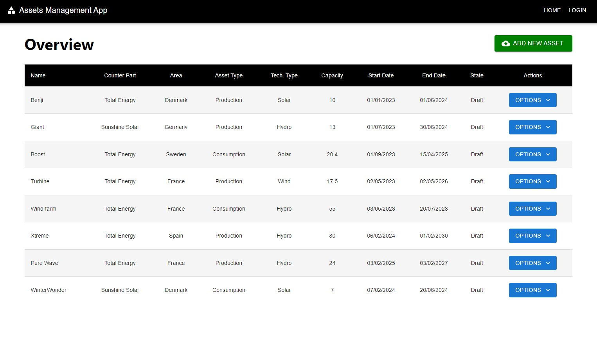
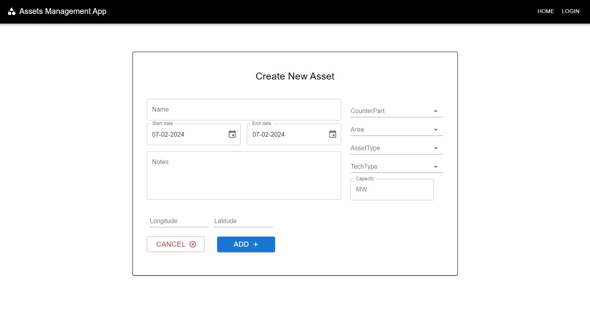

This project is fully operational; however, it will not display the current existing data in the database tables. 

This limitation arises from the absence of credentials necessary for establishing database connections, essential for rendering data within the browser. 

Regrettably, these credentials are confidential and not provided within this public GitHub repository.

If you wish to utilize your own database, please note that the settings should be configured within a appsettings.json file located within the API layer.

For demonstration purposes, presented below are screenshots showcasing the application pages:

Homepage:

Add Asset page:

